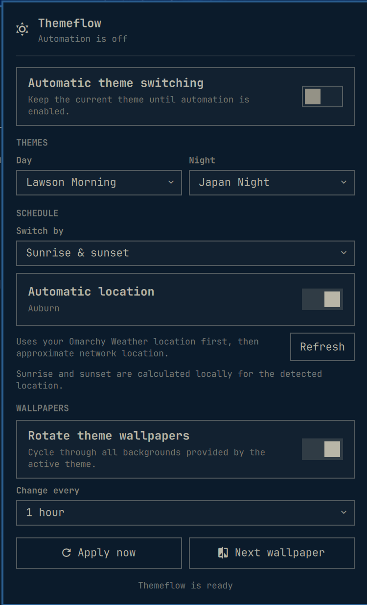

# Themeflow

Themeflow keeps an Omarchy desktop in rhythm with the day. It applies one
theme during daylight, another at night, and can cycle through every wallpaper
included with the active theme.



## Features

- Native Omarchy Shell bar widget and settings popup
- Fixed-time or locally calculated sunrise/sunset schedules
- Automatic solar location from Omarchy Weather, with an approximate network
  fallback when Weather has no saved coordinates
- Separate day and night theme selection from installed Omarchy themes
- Optional wallpaper rotation from 5 minutes to 1 day
- One-click apply and next-wallpaper controls
- Theme selectors with keyboard-capable search
- Sunrise and sunset are calculated on-device after location discovery
- Automation is off after a fresh install, so the desktop never changes before
  the user chooses to enable it

## Install

Install it through Omarchy's plugin manager:

```bash
omarchy plugin add https://github.com/phuclh/omarchy-themeflow.git --enable
```

For local development from this checkout:

```bash
./install-local.sh
```

The local installer validates the plugin, refuses to overwrite an existing
installation, copies it into the user plugin directory, and enables its bar
widget on the right.

## Requirements

- Omarchy Quattro with the Omarchy Shell plugin manager
- `curl` for the optional approximate-location fallback
- Network access to `wttr.in` only when automatic location is enabled and
  Omarchy Weather has no saved coordinates

Theme switching, wallpaper rotation, and sunrise/sunset calculation otherwise
use Omarchy's built-in commands and run locally.

## Remove

Remove the plugin through Omarchy:

```bash
omarchy plugin remove io.github.phuclh.themeflow
```

Themeflow leaves `~/.config/themeflow/settings.json` in place so a reinstall can
reuse your preferences. Delete `~/.config/themeflow` separately if you also
want to remove the saved settings.

## Use

- Left-click the sun/moon icon to open Themeflow.
- Right-click the icon to pause or resume automation.
- Middle-click the icon to move to the next wallpaper immediately.
- Choose **Fixed times** for a predictable clock schedule.
- Choose **Sunrise & sunset** to follow seasonal daylight automatically.
- **Automatic location** first reuses Omarchy Weather coordinates. If none are
  available, Themeflow requests an approximate location from `wttr.in`. Turn
  the toggle off to enter latitude and longitude manually.

Themeflow uses the supported Omarchy commands:

```bash
omarchy theme list
omarchy theme set <theme-name>
omarchy theme bg next
```

Settings are stored at `~/.config/themeflow/settings.json`. Themeflow runs as a
keep-loaded Omarchy Shell service, so it needs no separate daemon or systemd
unit.

## IPC

The service exposes a small Quickshell IPC target:

```bash
omarchy-shell themeflow status
omarchy-shell themeflow enable
omarchy-shell themeflow disable
omarchy-shell themeflow toggle
omarchy-shell themeflow apply
omarchy-shell themeflow nextWallpaper
```

## Development

Validate the manifest and run the pure schedule tests:

```bash
omarchy plugin validate .
TZ=America/Los_Angeles node tests/test_schedule.js
```

The scheduling tests cover ordinary day/night boundaries, schedules that span
midnight, sunrise/sunset calculation, and the fixed-time fallback used when
solar coordinates are invalid or unavailable.
